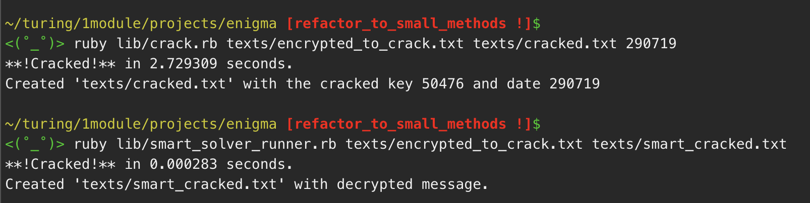
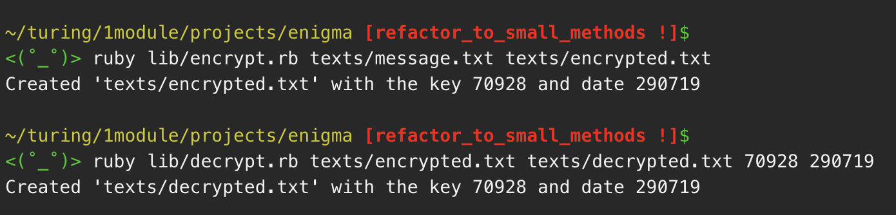

# Enigma

### Table of Contents
1. [Background](#background)
2. [Encryption and Decryption](#encryption)
3. [Cracking the Encryption](#cracking)
4. [Command Line Interface](#interface)
5. [Self Evaluation](#eval)

### Background <a name="background"></a>
Based on the concept of the encryption device used extensively by the Germans in
World War II, known as the Enigma machine, this code used key-based encryption to
encrypt plain text into ciphertext. As long as the keys used to generate the
encryption are known, decrypting the text back into human-readable text is fairly
straight-forward.

### Encryption and Decryption <a name="encryption"></a>
In the following code block, the arguments to the methods `encrypt` and `decrypt`
are the message, the key, and the date key. The last two arguments are used to
calculate the final shift values.

```
enigma = Enigma.new

encrypted = enigma.encrypt('hello world', '31415', '290719')
encrypted[:encryption]
=> "raeaywpdahx"

decrypted = enigma.decrypt('raeaywpdahx', '31415', '290719')
decrypted[:decryption]
=> 'hello world'
```

The user can specify the key and date, or let the computer generate a random key
and use today's date. In either case, the key and date must be known to decrypt
the message.

```
enigma = Enigma.new

enigma.encrypt('hello world')
=> {:encryption=>"ufdbaaoedmw", :key=>"61943", :date=>"290719"}

enigma.decrypt('ufdbaaoedmw', '61943', '290719')
=> {:decryption=>"hello world", :key=>"61943", :date=>"290719"}
```

### Cracking the Encryption <a name="cracking"></a>
If the key is not known, we can crack the ciphertext if we know the date of
message transmission, and that every message ends with " end". In this case, assume that
the return value is blind to the crack method, but is just here for illustrative purpose.

```
enigma = Enigma.new

enigma.encrypt('hello world end')
=> {:encryption=>"uicradnudpvfrrv", :key=>"34932", :date=>"290719"}

enigma.crack('uicradnudpvfrrv', '290719')
=> {:decryption=>"hello world end", :key=>"34932", :date=>"290719"}
```

The crack above uses brute force to try every key until it finds a key that transcribes
the message to terminate with " end". In this case, it takes only an average of
2.5 seconds to crack the encryption because of the limited number of key possibilities.
However, it would be more interesting if there was a smart crack that only uses the knowledge of the
terminal " end" and the underlying shift pattern (like taking apart the Enigma machine to
  analyze the circuitry).

```
solver = SmartSolver.new

solver.encrypt('hello world end')
=> {:encryption=>"uf  aakcdmsoros", :key=>"07368", :date=>"290719"}

solver.smart_crack("uf  aakcdmsoros")
=> "hello world end"
```

It works! Not only does it work, it is approximately 10,000 times faster than brute
force. Somewhat trivial in this case since brute force only takes a few seconds,
but it's proof that more sophisticated cracks are more efficient than brute force
by orders of magnitude.



### Command Line Interface <a name="interface"></a>
As seen in the image above, this code allows for command line interface that takes,
as command line arguments, text file paths to read and write. The encrypt and decrypt methods
have similar runner files, and decrypt takes the key and date values necessary for decryption.



### Self-Evaluation <a name="eval"></a>
- **Functionality:** *(4 / 4)* All methods function properly. Two types of cracks written, brute force and shift finder. Command line runners work properly.

- **Object Oriented Programming:** *(4 / 4)* The `RandomChars` module has a method called `random_characters` that could be used to generate random keys of desired length with upper case, lower case, and numeric characters. `RandomChars` method `random_digits` was used to generate random key for this project. `MessageFile` class uses `self.encrypt` and `self.decrypt` to read and transcribe text files.

- **Test Driven Development:** *(4 / 4)* Coverage is 131 / 131 lines (100%). Test names were chosen for clarity of purpose. Several tests in `EnigmaTest` and `MessageFileTest` use stubs for `random_digits` and `strftime`.

- **Version Control:** *(3.75 / 4)* As of now, 73 commits on 20 branches. I could have done a better job making sure to commit single pieces of functionality. I did for the most part, but I wasn't as deliberate about it at the beginning of the project as I should have been.
